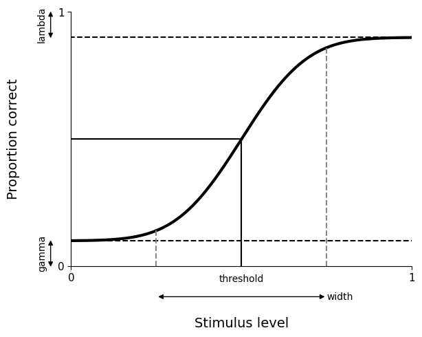

---
jupytext:
  text_representation:
    extension: .md
    format_name: myst
    format_version: 0.13
    jupytext_version: 1.16.4
kernelspec:
  display_name: Python 3 (ipykernel)
  language: python
  name: python3
---

# Basic usage

In this guide, we show the main features of *psignifit*. Please
look at the [installation guide](./install_guide) for instructions 
on how to install this package.

*psignifit* is a toolbox to fit psychometric functions from behavioral data. 
It comes with tools to visualize and evaluate the fit.

```{code-cell} ipython3
---
jupyter:
  outputs_hidden: false
---
import matplotlib.pyplot as plt

import psignifit as ps
import psignifit.psigniplot as psp
```


## Trial data format

Your data should be formatted as a *nx3 matrix* with columns for the stimulus level, the number of correct
responses and the number of total responses.

It should look something like this example dataset:

```{code-cell} ipython3
---
jupyter:
  outputs_hidden: True
---
#        levels, n-correct,   n-total
data = [[0.0010,   45.0000,   90.0000],
        [0.0015,   50.0000,   90.0000],
        [0.0020,   44.0000,   90.0000],
        [0.0025,   44.0000,   90.0000],
        [0.0030,   52.0000,   90.0000],
        [0.0035,   53.0000,   90.0000],
        [0.0040,   62.0000,   90.0000],
        [0.0045,   64.0000,   90.0000],
        [0.0050,   76.0000,   90.0000],
        [0.0060,   79.0000,   90.0000],
        [0.0070,   88.0000,   90.0000],
        [0.0080,   90.0000,   90.0000],
        [0.0100,   90.0000,   90.0000]]
```

This dataset comes from a simple signal detection experiment.

## Parameters of the psychometric function

In  *psignifit* the psychometric function is defined as a sigmoid
scaled by the guess and lapse rate.
The guess rate (*gamma*) and lapse rate (*lambda*) define the lower 
and upper asymptotes of the sigmoid, respectively. 



The guess rate (*gamma*) is fixed for nAFC experiments, at a value of 1/n.
Thus for a 2AFC experiment gamma is fixed to 0.5

The sigmoid has two parameters:
- its *threshold*, the stimulus level at which the unscaled psychometric 
function reaches 0.5
- its *width*, the difference between the 5th and the 95th percentiles of the
(unscaled) sigmoid


Finally *psignifit* also estimates an overdispersion parameter *eta*.
A value near zero indicates that the data are consistent with
a binomial distribution.
A value near one indicate severely overdispersed data,
that means, the data show a variance that is larger than the variance
expected from a binomial distribution.
Refer to the [original publication](http://www.sciencedirect.com/science/article/pii/S0042698916000390)
for more details on the interpretation of this parameter.


## Fitting the psychometric function

A simple call of the `psignifit` function
will fit a sigmoid function to the data:

```{code-cell} ipython3
---
jupyter:
  outputs_hidden: False
---
result = ps.psignifit(data, experiment_type='2AFC');
```

*psignifit* comes with presets for different psychometric
experiments. 
Apart from *nAFC* (`2AFC`, `3AFC`, ...) 
we provide two other options:  `yes/no` which enables 
free upper and lower asymptotes, and
`equal asymptote`, 
which assumes that the upper and the lower asymptote are equal. 
You find a more detailed description of the 
[experiment types here](examples/basic-options).

You also might want to specify the sigmoid you want to use. 
You do this by setting the parameter `sigmoid`. Default is 
the cummulative Gauss (`sigmoid="gauss"`). Another 
common alternative is the logistic (`sigmoid="logistic")`.

Refer to the [basic options page](examples/basic-options) and the [sigmoids page](examples/plot_all_sigmoids)
for all possible sigmoids implemented in *psignifit*.

Advanced users can pass more arguments to fine-tune the fitting procedure,
[as described here](examples/advanced-options).


## Getting results from the fit

The `result` is a python object with all information obtained from
fitting your data. Of primary interest are the fitted parameters
and their confidence intervals

```{code-cell} ipython3
---
jupyter:
  outputs_hidden: False
---
print(result.parameter_estimate)
```

This returns a python dictionary containing the estimated parameters.
Then, to obtain the threshold you run

```{code-cell} ipython3
print(result.parameter_estimate['threshold'])
```


Similarly, *psignifit* also returns the confidence intervals for 
each parameter. For example for the threshold 

```{code-cell} ipython3
print(result.confidence_intervals['threshold'])
```

Each element in this dictionary contain the lower and
upper bound for the asked confidences. 
In this case it returns the intervals for the default confidences of 
95%, 90% and 68%.

To get only the 95% threshold, you run 
```{code-cell} ipython3
print(result.confidence_intervals['threshold']['0.95'])
```

## Plotting the fitted function

The toolbox comes with a whole [collection of visualizations](examples/plotting). 
We show you here how to do some basic plotting of the psychometric function. 


```{code-cell} ipython3
plt.figure()
psp.plot_psychometric_function(result)
plt.show()
```

## Next steps

We covered the basic steps in using *psignifit*.
To dive deeper you can have a look at the *Usage guides*, the *Quick how-to*
and the *Extras* on the left navigation menu.
