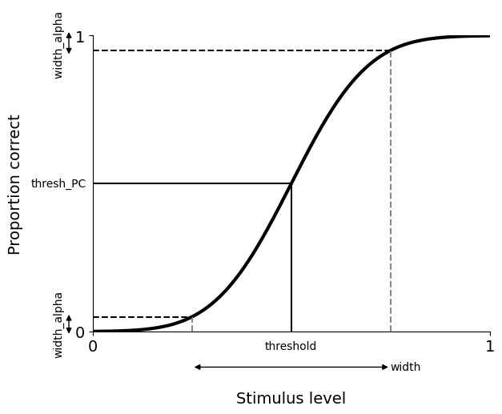

---
jupytext:
  text_representation:
    extension: .md
    format_name: myst
    format_version: 0.13
    jupytext_version: 1.16.4
kernelspec:
  display_name: Python 3
  language: python
  name: python3
---

# Advanced options

This demo explains the different advanced options that you can set as a user in *psignifit*.

```{code-cell} ipython3
import numpy as np

import psignifit as ps

# to have some data we use the data from the first demo.
data = np.array([[0.0010, 45.0000, 90.0000], [0.0015, 50.0000, 90.0000],
                 [0.0020, 44.0000, 90.0000], [0.0025, 44.0000, 90.0000],
                 [0.0030, 52.0000, 90.0000], [0.0035, 53.0000, 90.0000],
                 [0.0040, 62.0000, 90.0000], [0.0045, 64.0000, 90.0000],
                 [0.0050, 76.0000, 90.0000], [0.0060, 79.0000, 90.0000],
                 [0.0070, 88.0000, 90.0000], [0.0080, 90.0000, 90.0000],
                 [0.0100, 90.0000, 90.0000]])

res = ps.psignifit(data, sigmoid='norm', experiment_type='2AFC')
```


## Estimation Type
As described in detail in the section [Parameters estimates: MAP and mean](map_vs_mean), this option sets how you want to estimate your fit from the posterior.

- `mean`: using the posterior mean. 
- `MAP`: maximum a posteriori computed from the posterior. Default.

In a Bayesian sense the `mean` estimate is a more suitable estimate of the expected value of the posterior. 
However, in the original publication it is shown that the `MAP` estimate is preferable for psychometric function fitting, given the small datasets commonly used in experimental psychology and the neurosciences.
This justifies our choice of `MAP` as the default.


```{code-cell} ipython3
# This gives the default estimate, in this case the mean estimate since we set it in the options.
print(f"parameter estimate (default=MAP): {res.parameter_estimate}")
print(f"parameter estimate (MAP): {res.parameter_estimate_MAP}")
print(f"parameter estimate (mean){res.parameter_estimate_mean}")
```

you can also get it using this method:
```{code-cell} ipython3
print(res.get_parameter_estimate(estimate_type="MAP"))
```

## Optimization Steps
This option sets the number of grid points on each dimension in the final
fitting (`grid_steps`) and in the moving of bounds (`steps_moving_bounds`).
The number of steps is passed as a dictionary with keys `threshold`, `width`, `lambda` (upper asymptote),
`gamma` (lower asymptote), and `eta` (overdispersion parameter).

You may change this if you need more accurate estimates on the sparsely
sampled parameters. For example, to get an even more exact estimate on the
lapse rate/upper asymptote, set lambda to 50.
In this case the lapse rate is sampled at 50 points giving you a much more exact and smooth curve for comparisons.

```{code-cell} ipython3
res = ps.psignifit(data, grid_steps={'lambda': 50})
```

## Confidence intervals

### Confidence level
You can also personalize the confidence level for the computed confidence intervals.
This may be set to any number between 0 and 1 excluding.

For example to get 95% **and** 99% confidence intervals try

```{code-cell} ipython3
res = ps.psignifit(data, confP=(.95, .99))
```

### Computing method

The option `CI_method` sets how the confidence intervals are computed. The possible options are:

- `project`: project the confidence region from the multidimensional posterior grid on each axis.

- `percentiles`: find $\alpha/2$ and $(1-\alpha/2)$ percentiles (with $\alpha$ = 1 - confP). Default.

```{code-cell} ipython3
res = ps.psignifit(data, CI_method='percentiles')
# or
res = ps.psignifit(data, CI_method='project')
```

## Sigmoid parametrization

In *psignifit*, sigmoids are defined on the range between 0 and 1,
to be later scaled by *gamma* and *lambda*. 
These *unscaled* [sigmoids](plot_all_sigmoids) have two parameters:

- its *threshold*, by default being the stimulus level at which the sigmoid reaches 0.5
- its *width*, by default being the difference between the 95 and the 5 percentiles



You can change these definitions as explained in the following.

### Threshold definition (`thresh_PC`)

This option sets the proportion correct that will define the threshold,
on the *unscaled* sigmoid. 
Possible values are in the range from 0 to 1, default is 0.5. 
The default corresponds to 75\% in a 2AFC task (midway between the 
guess rate of 50 % and ceiling performance 100%).

To set it to a different value, for example to 90%, you'll do

```{code-cell} ipython3
res = ps.psignifit(data, thresh_PC=0.9)
```

Note that this value is changed on the *unscaled* sigmoid, so for a 2AFC 
task it corresponds to a 95 \%.

Note also that you will get a warning, because the default prior assumes that the experimental
stimulus range covers the range where the threshold likely falls. If this doesn't match your
setup, you'll need to pass custom priors and evaluate their adequacy. 
See the [priors demo](priors) to learn how to do it.


### Width definition (`width_alpha`)

The definition of the `width` parameter of a sigmoid can be changed with 
the option `width_alpha`. The width is defined as 

$\Psi^{-1}(1-\alpha) - \Psi^{-1}(\alpha)$ 

where $\Psi^{-1}$ is the inverse of the sigmoid function. 
The option `width_alpha` is $\alpha$ in the formula above, and must be
between 0 and .5 excluding. Default is `width_alpha = 0.05`

For example, the following code would redefine the width as 
the interval between percentiles 10 and 90.

```{code-cell} ipython3
res = ps.psignifit(data, width_alpha=0.1)
```


## Priors

You can set the priors manually passing them as a dictionary with the parameter name as key and the custom prior function
as the value.

For details on how do change these refer to the [priors demo](priors).


The strength of the prior in favor of a binomial observer can be set with
the `beta_prior` option. Larger values correspond to a stronger prior.
The default value is 10; we choose this value after
a rather large number of simulations. Refer to
[the original publication](http://www.sciencedirect.com/science/article/pii/S0042698916000390) 
to learn more about this.

```{code-cell} ipython3
res = ps.psignifit(data, beta_prior=15)
```


## Bounds

```{warning}
By changing the default bounds you might artificially bias the estimation procedure. 
The defaults were choosen after extensive simulations; these are reported in 
[the original publication](http://www.sciencedirect.com/science/article/pii/S0042698916000390). 
Change the defaults if you know what you are doing!
```

You may provide your own bounds for the parameters.
This should be a dictionary of the parameter name and tuples of
start and end of the range.

For example, the following setting will set the bounds for the threshold between 0 and 0.002,
for the lapse rate (lambda) between 0 and 0.1, and a fixed guess rate (gamma) to 0.5

```{code-cell} ipython3
custom_bounds = {
                 'threshold': (0.0, 0.015),
                 'lambda': (0.0, 0.1),
                 'gamma': (.5, .5),
                }
res = ps.psignifit(data, bounds=custom_bounds)
```


Parts of the grid which produce marginal values below a small value are rounded to zero 
and excluded in further calculations. This small value is set in parameter `max_bound_values`.
It should be a very small value and at least smaller than `1/(max(grid_steps))`.

This for example would exclude fewer values and more conservative
movement of the bounds:

```{code-cell} ipython3
res = ps.psignifit(data, max_bound_value=np.exp(-20))
```
