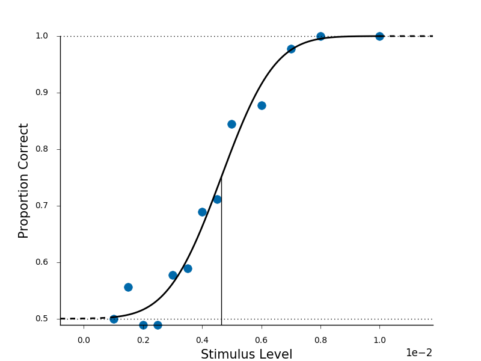

.. _getting_started:

Getting Started
===============

In this guide, we show the main features of *python-psignifit*.
Please look at the :ref:`install <install_guide>` how to install this toolbox.

*python-psignifit* is a toolbox to fit psychometric functions. It comes with tools to
visualize and evaluate the fit.

Trial data format
~~~~~~~~~~~~~~~~~

Your data for each psychometric function should be formatted as a *nx3
matrix* with columns for the stimulus level,
the number of correct responses and the number of total responses.

It should look something like this example dataset:

::

   #        levels, n-correct,   n-total
   data = [[0.0010,   45.0000,   90.0000],
           [0.0015,   50.0000,   90.0000],
           [0.0020,   44.0000,   90.0000],
           [0.0025,   44.0000,   90.0000],
           [0.0030,   52.0000,   90.0000],
           [0.0035,   53.0000,   90.0000],
           [0.0040,   62.0000,   90.0000],
           [0.0045,   64.0000,   90.0000],
           [0.0050,   76.0000,   90.0000],
           [0.0060,   79.0000,   90.0000],
           [0.0070,   88.0000,   90.0000],
           [0.0080,   90.0000,   90.0000],
           [0.0100,   90.0000,   90.0000]]

Fitting a psychometric function
~~~~~~~~~~~~~~~~~~~~~~~~~~~~~~~

A simple call to :func:`psignifit.psignifit` will fit your sigmoid function to the data:

::

   import psignifit as ps
   result = ps.psignifit(data, experiment_type='2AFC);

*python-psignifit* comes with presets for different psychometric experiments.
Beyond ``2AFC`` (or ``3AFC``, ``4AFC``, ...) we support ``yes/no`` and ``equal asymptote``.
Find more about experiment types in the :ref:`user guide <experiment-types>`.
Advanced users can pass many more arguments to fine-tune the fitting procedure, as described :ref:`here <options-dictionary>`.

The ``result`` is a python object with all information obtained from fitting your data.
Perhaps of primary interest are the fitted parameters and the confidence intervals:

::

   print(result.parameter_estimate)
   >> {'gamma': np.float64(0.5), 'eta': np.float64(0.00020997063016872368), 'lambda': np.float64(1.1284903011143352e-07), 'threshold': np.float64(0.00464706821831707), 'width': np.float64(0.004661060791841996)}
   
This is a python dictionary containing the estimated parameters. 
Similarly you obtain the confidence intervals for each parameter, for
example for the threshold 

::

   print(result.confidence_intervals['threshold'])
   [[0.004139257294429708, 0.005141909814323608], 
    [0.0041870026525198945, 0.0050941644562334226], 
    [0.004282493368700266, 0.0049986737400530504]]
    
Which is a list of lists. Each element in the list contain the lower 
and upper bound for the asked confidences. In this case the default
returns a list of 3 for the 95%, 90% and 68% confidence interval 
(in that order).

The parameters estimated by psignifit are:

1. *threshold*, the stimulus value of equal-odds
2. *width*, the difference between the 5 and the 95 percentile of the unscaled sigmoid
3. *lambda*, the lapse rate (upper asymptote of the sigmoid)
4. *gamma*, the guess rate (lower asymptote of the sigmoid). 
   This parameter is fixed for `nAFC` experiment types. 
5. *eta*,the overdispersion parameter. A value near zero
   indicates your data behaves binomially distributed, whereas
   values near one indicate severely overdispersed data.

Plotting the fitted function
~~~~~~~~~~~~~~~~~~~~~~~~~~~~

The toolbox comes with a whole collection of visulizations.
We provide some basic plotting of the psychometric function and the
posterior with the .

For example, running

::

   plt.figure()
   ps.psigniplot.plot_psychometric_function(result)
   plt.show()

See :ref:`this user guide <plot-functions>` to learn more about the visualizations.

Next steps
~~~~~~~~~~

We covered the basic steps in using *python-psignifit*.
Please refer to the :ref:`user-guides` and :ref:`demo-index`to dive deeper. The :ref:`how_tos` and :ref:`api_ref`
are helpful resources during the practical application.
