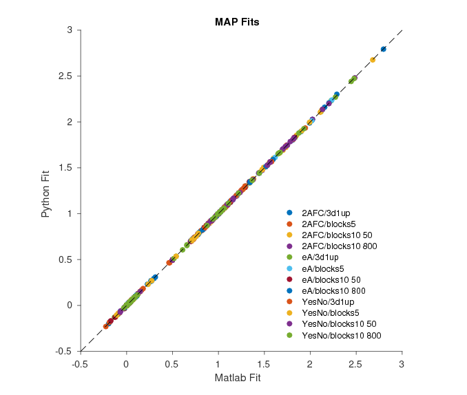
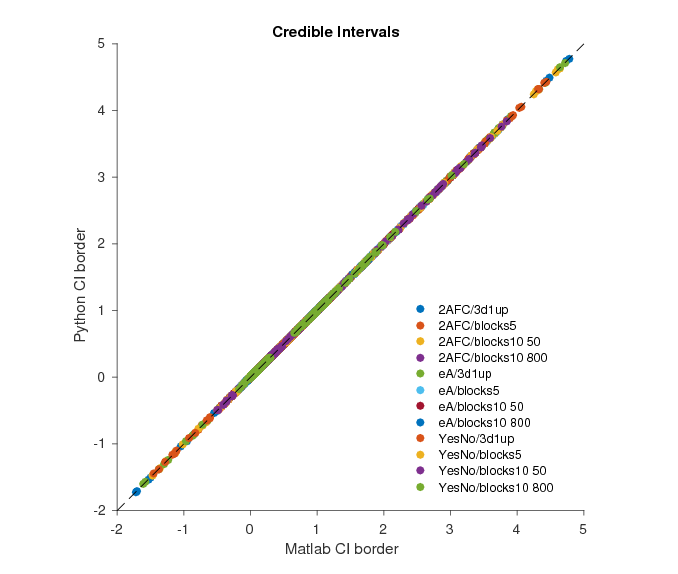
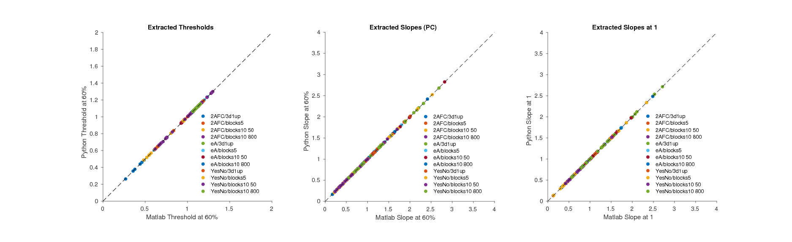

.. _test_matlab:

MATLAB Comparison
=================

We tested our the python clone exclusively against the MATLAB version.
To do so we took datasets generated for the tests presented in our paper
for each type of experiment (2AFC/equalAsymptote/YesNo) and fitted each
of them with each type of sigmoid. For each combination we used 2
replications from 4 types of dataset of binomial observer data: One with
5 blocks and 100 trials, one generated with a 3-down-1-up procedure and
two with 10 blocks and 50 and 800 trials respectively.

To see whether the results differ between MATLAB and python we plot
their results against each other for every comparison:

First we checked the MAP point estimates for the functions. These all
differ by less than 0.001 from each other:

Next we checked the constructed credible intervals: These values all
differ by less than 0.0001 from each other:

Finally we tested whether the methods to extract other descriptions of
the parameters from the fit work correctly. The three types are:

1. Extracting the threshold for different percent correct values
2. Extracting the slope at a given percent correct level
3. Extracting the slope at a given stimulus level

Judging by these plots the python clone seems to recreate all major
calculations of the MATLAB version faithfully. If you come across any
discrepancies or problems please tell us!
