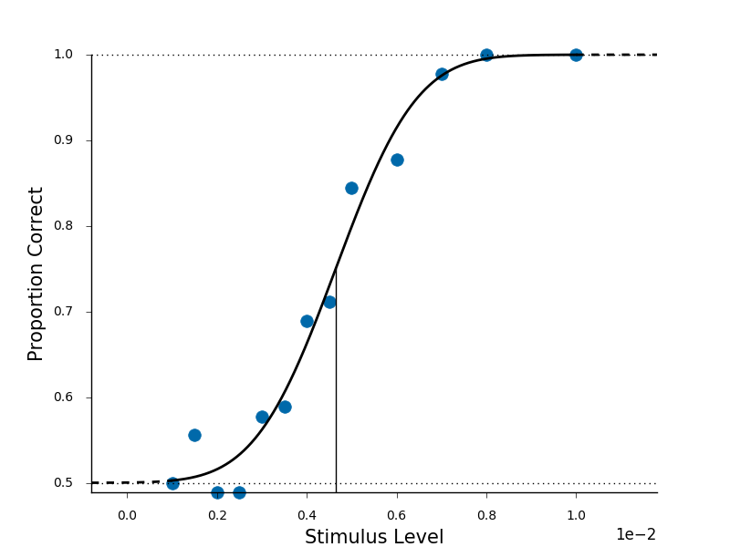

.. _basic-usage:

Basic Usage
===========

First :ref:`install <install_guide>` the toolbox.
After successful installation of psignifit you can fit
psychometric functions as described in this guide.
For a more interactive way to get started, look at
:ref:`Demo 1 <sphx_glr_generated_examples_demo_001.py>`.

As usually in python you first need to import the necessary packages.
Here we import numpy for array handling and psignifit.

::

   import numpy as np
   import psignifit as ps

Your data for each psychometric function should be formatted as a *nx3
matrix (stimulus level \| nCorrect \| ntotal)*. It should look something
like this example dataset:

::

   data = np.array([[0.0010,   45.0000,   90.0000],
                [0.0015,   50.0000,   90.0000],
                [0.0020,   44.0000,   90.0000],
                [0.0025,   44.0000,   90.0000],
                [0.0030,   52.0000,   90.0000],
                [0.0035,   53.0000,   90.0000],
                [0.0040,   62.0000,   90.0000],
                [0.0045,   64.0000,   90.0000],
                [0.0050,   76.0000,   90.0000],
                [0.0060,   79.0000,   90.0000],
                [0.0070,   88.0000,   90.0000],
                [0.0080,   90.0000,   90.0000],
                [0.0100,   90.0000,   90.0000]]);

With those ingredients a simple call to psignifit will fit your
function:

::

   result = ps.psignifit(data, experiment_type='2AFC);

Apart from the *nAFC* (2AFC, 3AFC, … ) we provide two other options
for *expType*: First *‘YesNo’* which enables a free upper and lower
Asymptote and, second, *‘equalAsymptote’*, which assumes that the upper
and the lower asymptote are equal. You find a more detailed description
of the types :ref:`here <experiment-types>`.

You can find a complete list of the possible options :ref:`here <options-dictionary>`.

*result* is a dictionary which contains all information obtained from
fitting your data. Perhaps of primary interest are the fit and the
confidence intervals:

::

   result.sigmoid_parameters
   result.confidence_intervals

This gives you the basic result of your fit. The five values reported
are:

1. the *threshold*
2. the *width* (difference between the 95 and the 5 percent point of the
   unscaled sigmoid)
3. *lambda*, the upper asymptote/lapse rate
4. *gamma*, the lower asymptote/guess rate
5. *eta*, scaling the extra variance introduced (a value near zero
   indicates your data to be basically binomially distributed, whereas
   values near one indicate severely overdispersed data)

We provide some basic plotting of the psychometric function and the
posterior with the :ref:`plotting functions <plot-functions>`.

For example, running

::

   ps.psigniplot.plotPsych(result)

plots the psychometric function given the data and options as provided
and set above:

