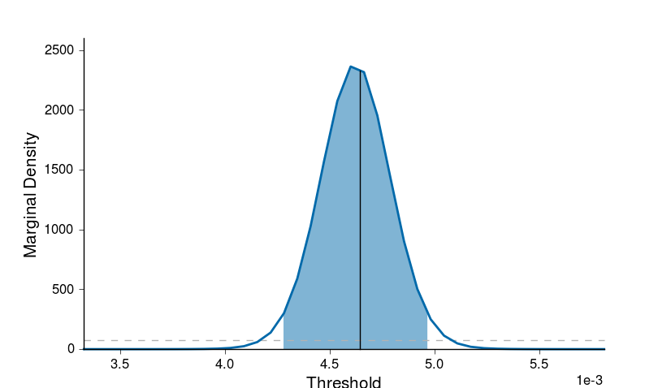
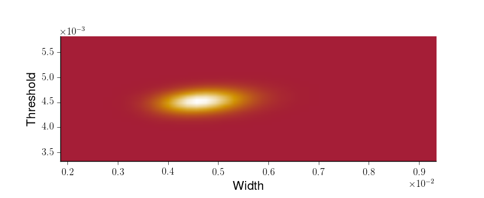
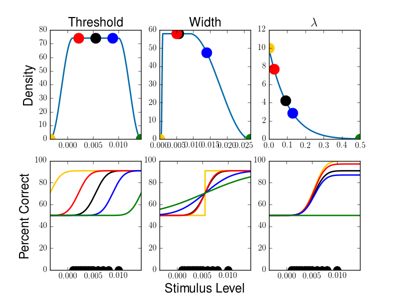

.. _plot-functions:

Plot Functions
==============

Here we explain the basic plot functions of python-psignifit 4. Most of
the functions return the handle of the axis they plotted in to enable
you to plot further details and change axis properties after the plot.
The functions themselves are contained in the file psigniplot and are
automatically imported as psignifit.psigniplot when you import psignifit
as a whole.

One slight complication, which comes with matplotlib is that showing the
graph will mark it complete, effectively not allowing you to change it
any more. To allow you to plot multiple plots into one figure or axis,
we added the flag showImediate to all plot-functions. By default this is
true such that the figure is immediately displayed at the end of the
function. If you want to change the figure more before display, set
showImediate = False.

plotPsych
---------

This function plots the fitted psychometric function with the measured
data. It takes the *result* struct you want to plot and diverse options
for the plot as input.

::

   psignifit.psigniplot.plotPsych(result,...)

.. figure:: ../images/demo_001_1.png

The following options may be provided (the value gives the standard
value):

::

             dataColor      = [0, 105./255, 170./255],
             plotData       = True,
             lineColor      = [0, 0, 0],
             lineWidth      = 2,
             xLabel         = 'Stimulus Level',
             yLabel         = 'Proportion Correct',
             labelSize      = 15,
             fontSize       = 10,
             fontName       = 'Helvetica',
             plotAsymptote  = True,
             plotThresh     = True,
             aspectRatio    = False,
             extrapolLength = .2,
             CIthresh       = False,
             dataSize       = 0,
             axisHandle     = None,
             showImediate   = True

plotMarginal
------------

This function plots the marginal posterior density for a single
parameter. As input it requires a results struct, the parameter to plot
and optionally a handle to an axis to plot in and an options struct. (As
usual *1 = threshold, 2 = width, 3 = lambda, 4 = gamma, 5 = sigma*)

::

   ps.psigniplot.plotMarginal(result,dim,...)

The coloured patch corresponds to the chosen confidence interval and the
black line shows the point estimate for the plotted parameter. The prior
is also included in the plot as a grey dashed line. The difference
between the posterior and the prior is provides visual information about
how much you have learned about the parameters of the psychometric
function from the data. If all posteriors are very similar to the
priors, you may either have insufficient data and/or have specified too
narrow (specific) priors.

The named options for this function are:

::

                dim        = 0,
                lineColor  = [0, 105/255, 170/255],
                lineWidth  = 2,
                xLabel     = '',
                yLabel     = 'Marginal Density',
                labelSize  = 15,
                tufteAxis  = False,
                prior      = True,
                priorColor = [.7, .7, .7],
                CIpatch    = True,
                plotPE     = True,
                axisHandle = None,
                showImediate   = True

plot2D
------

This plots 2 dimensional posterior marginals. As input this function
expects the result struct, two numbers for the two parameters to plot
against each other and optionally a handle h to the axis to plot in and
an options struct for further options.

::

   plot2D(result,par1,par2,plotOptions)

As options the following options can be set:

::

           colorMap = getColorMap(), 
           labelSize = 15,
           fontSize = 10,
           axisHandle = None,
           showImediate   = True

plotPrior
---------

As a tool this function plots the used priors of the provided result
struct.

::

   ps.plot.plotPrior(result)

